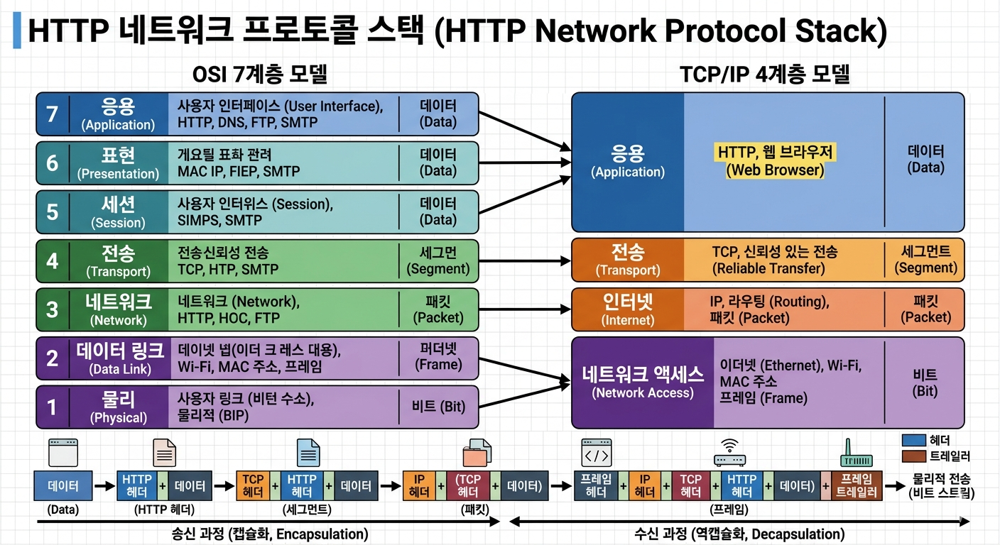

# 1장 HTTP 개관 정리 및 토론 주제

## 1. 웹 서버 리소스의 개념
웹 서버에서 '리소스(Resource)'란 단순히 하드디스크에 저장된 정적 파일(HTML, 이미지 등)만을 의미하지 않습니다.
URI로 고유하게 식별할 수 있고, 클라이언트에게 응답(데이터)을 반환할 수 있는 네트워크상의 **모든 대상**을 리소스로 간주합니다.
따라서 인터넷 검색엔진, 주식 시세 서버와 같이 실시간으로 동적 데이터를 생성해내는 소프트웨어 프로그램이나 게이트웨이 등도 모두 HTTP 관점에서는 리소스에 해당합니다.

## 2. MIME 타입과 파일 저장 방식
HTTP는 전송되는 데이터의 종류를 식별하기 위해 `Type/Subtype` 형태의 MIME 타입을 사용합니다. (예: `text/html`, `image/jpeg`, `application/octet-stream`)

**파일 저장 시 접근 방법 (URL vs BLOB)**
* **URL 방식 (일반적 권장):** 파일을 외부 저장소(파일 시스템, AWS S3 등)에 저장하고, DB에는 파일의 경로(URL)와 MIME 타입을 텍스트로 저장하는 방식. 서버 부하를 줄이고 CDN 연동에 유리하여 현업에서 대부분 사용하는 방식입니다.
* **BLOB 방식:** 이미지 파일 자체의 바이너리 데이터를 DB의 BLOB 컬럼에 직접 저장하는 방식. 트랜잭션과 보안 관리에는 유리하지만 DB 용량 및 성능 이슈로 인해 결제 서명, 신분증 스캔본 등 매우 제한적인 특수 상황에만 사용됩니다.

## 3. URI (Uniform Resource Identifier)
인터넷 상의 리소스를 식별하는 고유한 이름입니다.
* **URL (Uniform Resource Locator):** 리소스가 현재 '어디에' 위치해 있는지를 기반으로 식별합니다. (대부분의 웹에서 사용)
* **URN (Uniform Resource Name):** 리소스의 위치 변경과 무관하게, 리소스 자체에 고유한 '이름'을 부여하여 식별합니다.

### 💡 RESTful API에서의 URI 구성
RESTful 아키텍처에서 URI는 '행위'가 아닌 **'자원(명사)'**을 표현해야 합니다. 행위는 HTTP 메서드로 표현합니다.
* **Bad:** `/getUsers`, `/deletePost/1`
* **Good:** `GET /users`, `DELETE /posts/1`

## 4. HTTP 메서드
| 메서드 | 설명 |
|---|---|
| **GET** | 지정한 리소스를 서버에 요청 (조회) |
| **POST** | 클라이언트 데이터를 서버로 전송 (생성, 처리) |
| **PUT** | 지정한 리소스의 전체를 교체하거나 생성 (수정) |
| **PATCH** | 지정한 리소스의 일부를 수정 |
| **DELETE** | 지정한 리소스를 삭제 |
| **HEAD** | GET과 동일하지만 HTTP 응답의 헤더만 반환 (본문 없음) |
| **OPTIONS** | 서버가 특정 리소스에 대해 어떤 메서드를 지원하는지 확인 |
| **TRACE** | 클라이언트의 요청이 서버에 도달하기까지 거치는 경로 테스트 |

## 5. 자주 쓰이는 HTTP 상태 코드
* **200 OK:** 요청 성공
* **201 Created:** (POST/PUT 등에 의해) 리소스 생성 성공
* **301 Moved Permanently:** 리소스의 위치가 영구적으로 이동됨 (브라우저가 새 URL로 자동 리다이렉트)
* **302 Found:** 리소스의 위치가 임시로 이동됨
* **400 Bad Request:** 클라이언트의 잘못된 요청 (파라미터 누락 등)
* **401 Unauthorized:** 인증되지 않은 사용자
* **403 Forbidden:** 인증은 되었으나 접근 권한이 없음
* **404 Not Found:** 서버에서 요청한 리소스를 찾을 수 없음
* **500 Internal Server Error:** 서버 내부 시스템 오류 발생

## 6. HTTP의 주요 헤더
* **Host:** 요청하는 호스트명과 포트 번호 (가상 호스팅 환경에서 필수)
* **Content-Type:** 요청/응답 본문(Body)의 MIME 타입 지정
* **Content-Length:** 본문의 길이(바이트 단위)
* **User-Agent:** 클라이언트의 브라우저 애플리케이션 이름, 버전, OS 정보
* **Accept:** 클라이언트가 서버로부터 받고자 하는 미디어 타입 명시

## 7. TCP/IP와 네트워크 프로토콜 스택
HTTP는 전송 계층 프로토콜로 신뢰성 있는 TCP/IP를 사용합니다.
> **"TCP/IP는 각 네트워크와 하드웨어의 특성을 숨기고, 어떤 종류의 컴퓨터나 네트워크든 서로 신뢰성 있는 의사소통을 하게 해 준다."**

**HTTP 네트워크 프로토콜 스택**

## 8. URL의 차이 분석
* `http://207.200.83.29:80/index.html` : 도메인 이름 대신 서버의 물리적인 **IP 주소**를 직접 사용했으며, 기본 포트(80)를 명시했습니다.
* `http://www.netscapte.com:80/index.html` : 사람이 읽기 쉬운 **도메인 이름**을 사용했고, 기본 포트(80)를 명시했습니다. 내부적으로 DNS를 통해 IP로 변환됩니다.
* `http://www.netscapte.com/index.html` : **가장 일반적인 형태**입니다. 도메인 이름을 사용하고 포트를 생략했으나, HTTP 프로토콜(`http://`)을 보고 브라우저가 자동으로 80번 포트로 연결합니다.

## 9. Telnet 이란?
인터넷이나 로컬 영역 네트워크 연결에 쓰이는 텍스트 기반의 네트워크 프로토콜 및 도구입니다. HTTP 프로토콜은 사람이 직접 읽고 쓸 수 있는 평문(Plain text) 형태이기 때문에, Telnet을 이용해 특정 웹 서버 포트(80)에 접속한 뒤 직접 HTTP 요청 텍스트를 타이핑해서 보내면, 서버로부터 돌아오는 원시 형태의 HTTP 응답(시작줄, 헤더, 본문)을 눈으로 직관적으로 확인할 수 있어 HTTP 트랜잭션 학습용으로 매우 유용합니다.

## 10. 웹의 구성요소
* **프록시 (Proxy):** 클라이언트와 서버 사이에 위치하여 HTTP 트래픽을 중개하고 제어하는 역할을 합니다. (보안, 접근 제어 등)
* **캐시 (Cache):** 자주 찾는 문서의 사본을 임시로 저장해 두는 특별한 프록시로, 서버 부하를 대폭 줄이고 응답 속도를 향상시킵니다.
* **게이트웨이 (Gateway):** 서로 다른 프로토콜(예: HTTP와 FTP) 간의 변환을 수행하거나, 웹 서버가 WAS와 연동하여 동적 리소스를 제공할 수 있도록 하는 징검다리 서버입니다.
* **터널 (Tunnel):** HTTP 통신을 파싱하지 않고 맹목적으로 전달만 하는 장치로, 주로 SSL 암호화 트래픽(HTTPS)을 안전하게 전달할 때 사용됩니다.
* **에이전트 (Agent):** 사용자를 대신해 자동으로 HTTP 요청을 만들어 보내는 클라이언트 프로그램입니다. (예: 웹 브라우저, 검색 엔진 크롤러봇)

---

## 🗣️ 서술식 토론 문제

**토론 주제 1: 프록시 환경에서 클라이언트의 진짜 IP 판별 및 보안**
> **배경 지식:**
> 서버에서 악성 사용자를 IP 기반으로 차단(Block)하려고 할 때, 클라이언트가 웹 서버로 직접 붙지 않고 프록시나 로드 밸런서(CDN 등)를 거쳐서 오면 TCP 수준의 원본 IP는 프록시의 IP로 변하게 됩니다. 이를 해결하기 위해 HTTP 헤더에 클라이언트의 원래 IP를 담아서 보내는 표준 및 관례들이 있습니다.
> * `X-Forwarded-For (XFF)`: 가장 널리 쓰이는 표준 헤더로, 거쳐온 프록시들의 IP가 콤마로 구분되어 누적됩니다. (`Client IP, Proxy1 IP, Proxy2 IP...`)
> * `X-Real-IP`: Nginx 등에서 주로 쓰며, 바로 직전의 클라이언트 IP 하나만 담습니다.
> * `True-Client-IP`: Akamai 등 특정 CDN에서 원본 IP를 식별하기 위해 사용합니다.
>
> **질문:**
> 공격자가 악의적으로 자신의 컴퓨터에서 HTTP 요청을 보낼 때 `X-Forwarded-For: 8.8.8.8` 과 같이 헤더 값을 위조(Spoofing)해서 보낼 수 있습니다. 그렇다면 백엔드 애플리케이션(WAS) 입장에서는 헤더에 담긴 여러 IP 중 어떤 것을 진짜 사용자의 IP로 신뢰해야 할까요? 앞단의 프록시 계층(예: AWS ALB, Nginx)과 애플리케이션 계층이 어떻게 협력해야 안전하게 진짜 IP를 판별할 수 있는지 논의해 봅시다.

**토론 주제 2: RESTful 아키텍처와 HTTP (아래 3가지 질문 중 하나를 선택해 보세요)**
> HTTP의 본질을 활용하는 RESTful 아키텍처에 관한 세 가지 질문 옵션입니다.
>
> **옵션 A (메서드와 멱등성):**
> RESTful API를 설계할 때 `POST`와 `PUT`은 모두 데이터를 서버로 전송하는 역할을 하지만, `PUT`은 멱등성(Idempotency, 여러 번 수행해도 결과가 같음)을 가져야 하고 `POST`는 그렇지 않습니다. HTTP의 특성을 고려할 때, 왜 이러한 멱등성 구분이 중요하며 실무에서 어떤 예외 상황(예: 네트워크 타임아웃 시 재시도)을 방지할 수 있는지 토론해 봅시다.
>
> **옵션 B (상태 코드 활용의 깊이):**
> 일부 실무 환경에서는 API를 설계할 때 HTTP 상태 코드는 무조건 `200 OK`로 응답하고, 에러 여부는 JSON 본문(Body) 안에 `{"code": 500, "message": "error"}` 형태로 내려주는 방식을 사용하기도 합니다. 이러한 설계가 RESTful 원칙과 HTTP 웹 아키텍처(캐시, 프록시 장비 등) 관점에서 어떤 문제점(안티 패턴)을 발생시킬 수 있는지 장단점을 비교해 봅시다.
>
> **옵션 C (URI와 자원의 표현):**
> RESTful API에서는 URI를 통해 '행위'가 아닌 '자원(명사)'을 표현하라고 권장합니다. 하지만 실무에서는 "사용자의 비밀번호를 초기화한다"거나 "특정 프로세스를 강제로 실행시킨다"와 같이 자원으로 표현하기 애매한 동사적 행위들이 존재합니다. HTTP와 REST의 원칙을 해치지 않으면서 이러한 특수한 행위들을 어떻게 URI로 우아하게 풀어낼 수 있을지 의견을 나눠 봅시다.
