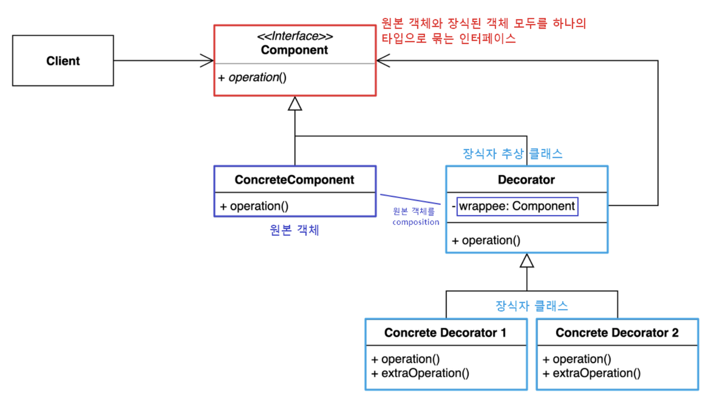
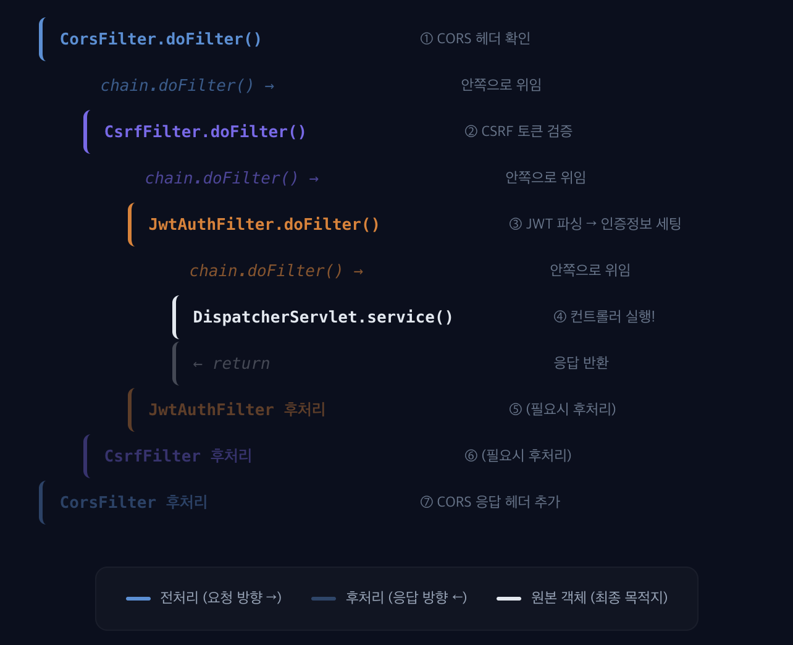

## 프록시 패턴

> **프록시**
> 프록시는 대리인이란 뜻입니다. 프록시 서버란 인터넷 상의 여러 네트워크들에 접속할 때 중계 역할을 해주는 프로그램 또는 컴퓨터를 의미합니다.

프록시 패턴의 핵심은 `관심사의 분리`입니다. 클라이언트가 바라보는 인터페이스는 그대로 유지하면서, 실제 객체에 대한 접근을 대리 객체가 제어하는 것, 클라이언트는 본인이 프록시 객체를 쓰고 있는지 모르는 것이 핵심적인 것입니다.

### 프록시 패턴의 목적
- 접근 제어
- 지연 로딩
- 부가 기능 추가

### 프록시 패턴 예시

1. `@Transactional`

```java
@Service
public class OrderService {

    @Transactional
    public void placeOrder(OrderRequest request) {
        orderRepository.save(new Order(request));
        paymentService.pay(request.getPaymentInfo());
        stockService.decrease(request.getItems());
    }
}
```

트랜잭션 어노테이션을 사용하면 하나의 메소드에는 비즈니스 로직만 작성해도 트랜잭션 기능을 추가할 수 있습니다. 해당 어노테이션을 사용하면 어노테이션이 붙은 메소드의 클래스를 감싼 프록시 객체를 생성하여 사용합니다.

```java
// 스프링이 내부적으로 만들어주는 프록시의 동작 (개념적 의사코드)
public class OrderServiceProxy extends OrderService {

    private final TransactionManager txManager;
    private final OrderService target; // 진짜 OrderService

    @Override
    public void placeOrder(OrderRequest request) {
        txManager.begin();
        try {
            target.placeOrder(request);  // 진짜 객체에 위임
            txManager.commit();
        } catch (Exception e) {
            txManager.rollback();
            throw e;
        }
    }
}
```

위와 같은 프록시 객체를 만들어서 로직이 실행됩니다. 

트랜잭션 어노테이션을 사용할 때 흔하게 발생하는 오류 중 self-invocation 문제가 있습니다. 

`this.method()` 이런 식으로 메소드를 사용하게 되면 트랜잭션이 의도한대로 동작하지 않는 현상입니다. this 로 메소드를 호출하게 되면 자동으로 생성된 프록시 객체의 메소드가 실행되는 것이 아니라 본 객체의 메소드가 그대로 실행되기 때문에 그런 문제가 발생하게 됩니다. 


2. `FetchType.LAZY`

```java
@Entity
public class Order {

    @ManyToOne(fetch = FetchType.LAZY)
    private Member member;  // 실제로는 Member의 프록시가 들어옴
}
```

JPA 에서 사용되는 FetchType.LAZY 의 경우도 프록시 객체를 사용하여 구현된 기술입니다.
Order.getMemeber() 를 호출해서 확인해보면 Member$HibernateProxy$... 이런식으로 실제 Member 객체가 아닌 프록시 객체임을 확인할 수 있습니다. 

프록시 객체를 이용함으로써 생성 비용이 큰 객체를 생성할 때 바로 생성하는게 아니라 해당 데이터가 실제 필요할 때까지 미룸으로써 이점을 가져갈 수 있습니다.

## 데코레이터 패턴

데코레이터 패턴은 말 그대로 원본 객체에 하나의 기능을 장식처럼 추가하는 패턴을 말한다.



데코레이터 패턴을 클래스 레벨에서 바라보면 위 그림과 같이 하나의 인터페이스를 원본 객체와 원본 객체에 기능을 추가해줄 데코레이터 객체들이 상속받고 있는 구조를 가지고 있다. 

### 데코레이터 패턴 예시

1. Spring Security Filterchain

```java
@Configuration
@EnableWebSecurity
public class SecurityConfig {

    @Bean
    public SecurityFilterChain apiFilterChain(HttpSecurity http) throws Exception {
        http
            .csrf(csrf -> csrf.disable())
            .cors(cors -> cors.configurationSource(corsConfigurationSource()))
            .sessionManagement(session -> 
                session.sessionCreationPolicy(SessionCreationPolicy.STATELESS)
            )
            .authorizeHttpRequests(auth -> auth
                .requestMatchers("/api/auth/**").permitAll()
                .requestMatchers("/api/admin/**").hasRole("ADMIN")
                .requestMatchers("/api/**").authenticated()
                .anyRequest().permitAll()
            )
            .addFilterBefore(
                jwtAuthenticationFilter(), 
                UsernamePasswordAuthenticationFilter.class
            )
            .exceptionHandling(ex -> ex
                .authenticationEntryPoint((req, res, authEx) -> {
                    res.setStatus(HttpServletResponse.SC_UNAUTHORIZED);
                    res.setContentType("application/json");
                    res.getWriter().write("{\"error\": \"인증이 필요합니다\"}");
                })
                .accessDeniedHandler((req, res, accessEx) -> {
                    res.setStatus(HttpServletResponse.SC_FORBIDDEN);
                    res.setContentType("application/json");
                    res.getWriter().write("{\"error\": \"권한이 없습니다\"}");
                })
            );

        return http.build();
    }
}
```

Http 요청을 받으면 서블릿 컨테이너(e.g Tomcat) 은 FilterChainProxy 에게 요청을 위임하고 FilterChain 에 등록된 데코레이터들을 돌면서 각각의 기능들이 처리되고 DispatcherServlet 으로 Http 요청이 전달되는 것입니다.



2. Spring Cache

```java
@Service
public class ProductService {

    @Cacheable(value = "products", key = "#id")
    public Product findById(Long id) {
        // DB 조회 — 비용이 큰 연산
        return productRepository.findById(id)
                .orElseThrow(() -> new ProductNotFoundException(id));
    }
}

// 스프링 캐시 프록시의 개념적 동작
public class ProductServiceCacheDecorator implements ProductService {

    private final ProductService target;
    private final Cache cache;

    @Override
    public Product findById(Long id) {
        Product cached = cache.get(id);
        if (cached != null) {
            return cached;               // 캐시에 있으면 타깃 호출 안 함
        }
        Product product = target.findById(id);  // 없으면 타깃에 위임
        cache.put(id, product);
        return product;
    }
}
```

@Cachable 어노테이션도 내부적으로 데코레이터 패턴을 사용하여 동작합니다.

그런데 한가지 이상한 것이 프록시 패턴과 굉장히 유사한 패턴을 보이고 있다는 점입니다. 

프록시 패턴이나 데코레이터 패턴은 그 구현 방식이 굉장히 유사합니다. 명확히 이 둘을 구분해내기는 어렵습니다. 이 둘을 명확히 구분하기보다 중간 객체를 통해서 핵심 로직은 유지하면서 기능을 추가하는 것인지 타깃에 대한 접근을 통제하고 있는지에 주목하는 것이 바람직한 접근이라고 생각됩니다.

## 다이나믹 프록시 

```java
public class OrderServiceProxy implements OrderService {

    private final OrderService target;

    @Override
    public void placeOrder(OrderRequest request) {
        txManager.begin();
        try {
            target.placeOrder(request);
            txManager.commit();
        } catch (Exception e) {
            txManager.rollback();
            throw e;
        }
    }
}
```

위에서 살펴봤던 프록시 구현 방법을 정적 프록시라고 합니다. 타겟이 되는 클래스를 알고 있어야 합니다. 타겟이 되는 클래스를 알고 있어야 하기 때문에 트랜잭션을 적용해야하는 타깃이 늘어날수록 프록시 클래스도 많아진다는 한계를 가지고 있습니다.

이러한 한계를 극복하기 위해서 이런 프록시를 미리 생성해두는 것이 아니라 런타임 환경에서 동적으로 생성하기 위해 나타난 것이 다이나믹 프록시입니다.

java 에서는 java.lang.reflct.Proxy 라는 동적 프록시를 위한 인터페이스를 제공하고 있습니다.

```java
public interface InvocationHandler {
    public Object invoke(Object proxy, Method method, Object[] args)
        throws Throwable;
}

// 부가 기능 로직을 "한 곳에" 정의
InvocationHandler handler = (proxy, method, args) -> {
    txManager.begin();
    try {
        Object result = method.invoke(target, args);  // 타깃에 위임
        txManager.commit();
        return result;
    } catch (Exception e) {
        txManager.rollback();
        throw e;
    }
};
```

InvocationHandler 인터페이스를 통해서 프록시를 이용해서 적용할 로직을 구현합니다. 

구현체에 프록시로 감쌀 클래스에 대한 정보만 넘겨주면 InvocationHandler 하나만을 이용해서 동적으로 프록시가 만들어진다.

## Spring AOP

어떤 어플리케이션을 만들 때 여러 기능들이 존재합니다. 

주문, 배송, 결제 ... 비즈니스 로직들이 있고 각 기능들에 공통적으로 성능 체크, 로깅, 트랜잭션 ... 등이 필요합니다.

주문이라는 기능을 구현할 때 성능 체크, 로깅, 트랜잭션 처리도 같이 구현하게 되면 코드가 굉장히 복잡하고 핵심적인 로직에 집중하기 어렵습니다.

때문에 이런 공통적으로 적용되어야 하는 로직과 비즈니스 로직을 분리하기 위해 등장한 것이 AOP(Aspect Oriented Programming) 관점지향프로그래밍입니다.

### 주요 개념

- Aspect : 관심사, 예를 들면 트랜잭션이 하나의 관심사입니다.
- Advice : 분리한 관심사에서 구체적으로 어떤 코드를 실행할 것인가에 대한 것을 결정합니다.
- JoinPoint : 어디에 이 분리한 관심사를 적용할 것인지를 의미합니다. Spring AOP 는 다이나믹 프록시 기반이기 때문에 메소드가 JoinPoint 에 해당합니다.
- Pointcut : 정확히 어떤 메서드에만 적용할지 걸러내는 필터입니다.
- Advisor : Advice, Pointcut 을 합친 개념

```java
@Aspect        
@Component  
public class PerformanceAspect {

    @Around("@annotation(Monitored)")
    public Object measure(ProceedingJoinPoint joinPoint) throws Throwable {
        long start = System.currentTimeMillis();
        Object result = joinPoint.proceed();
        log.info("{}ms", System.currentTimeMillis() - start);
        return result;
    }
}
```

위 예시를 분석해보면 성능 측정이라는 하나의 Aspect 를 분리한 것이고 Monitored 라는 어노테이션이 붙어있는 메소드에 한정(Pointcut)하여 관심사를 추가하라는 것이다.

