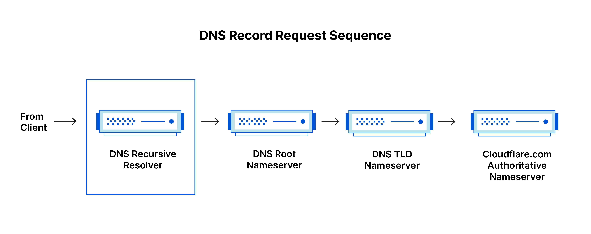
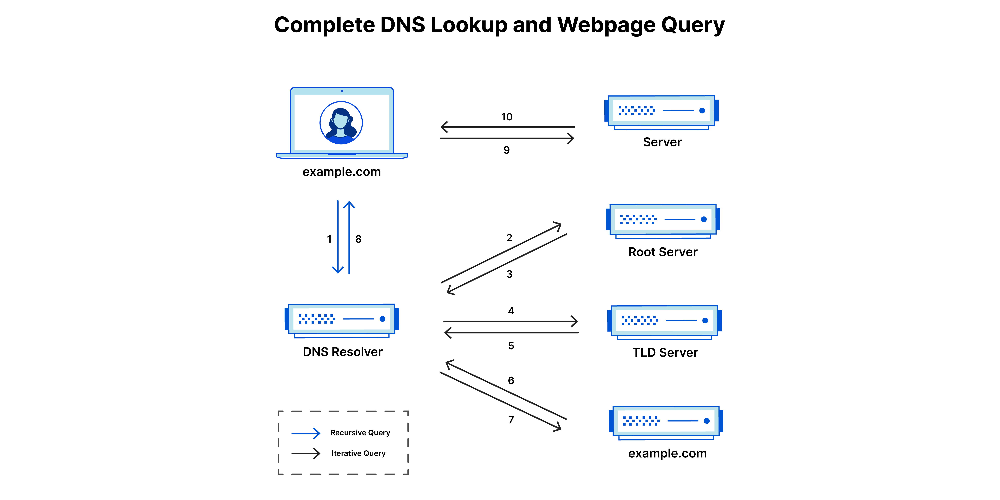
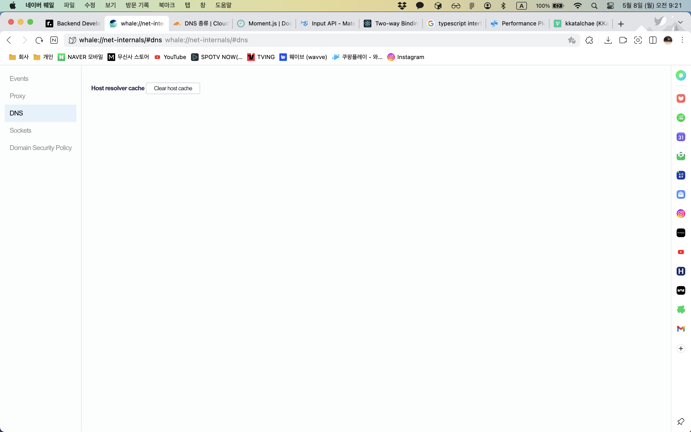

# DNS

### 웹 페이지로드와 관련된 DNS 서버

`DNS recursor`

DNS 재귀자는 클라이언트 대신 다른 DNS 서버로 요청을 전달하는 서버입니다. 이는 리졸버 또는 재귀 리졸버로도 알려져 있습니다.

클라이언트가 도메인 이름 해결을 요청하면 DNS 재귀자는 상위 도메인의 권위 있는 이름 서버를 결정하기 위해 루트 서버에 요청을 보냅니다. 그런 다음 요청된 도메인 이름의 하위 수준마다 권위 있는 이름 서버에 요청을 보내서 IP 주소를 얻습니다.

DNS 재귀자는 이름 서버의 응답을 캐시하여 동일한 도메인 이름에 대한 후속 요청의 응답 시간을 줄입니다. 이 캐싱 메커니즘은 DNS 해결 프로세스의 성능을 향상시키고 이름 서버의 부하를 줄이는 데 도움이 됩니다.

또한 DNS 재귀자는 원치 않는 트래픽을 필터링하고 악성 도메인에 대한 액세스를 차단하는 등 추가 기능을 수행할 수도 있습니다.

요약하면, DNS 재귀자는 도메인 이름 해결에 중요한 구성 요소이며 DNS 시스템의 성능과 보안을 향상시키는 중요한 역할을 합니다.

`root name server`

루트 이름 서버는 DNS 해결 프로세스의 첫 번째 단계입니다. .com, .org, .net과 같은 최상위 도메인(TLD)의 해결을 담당합니다. 전 세계에는 13개의 루트 이름 서버가 분산되어 있으며 각각 고유한 IP 주소를 가지고 있습니다.

클라이언트가 도메인 이름 해결을 요청하면 DNS 리졸버는 요청을 루트 이름 서버로 보냅니다. 루트 이름 서버는 TLD 이름 서버에 대한 참조를 응답하며, 이를 통해 요청된 도메인의 권위 있는 이름 서버 정보를 제공할 수 있습니다.

루트 이름 서버는 모든 도메인 이름 해결의 초기 참조점을 제공하기 때문에 DNS 시스템에서 매우 중요합니다. 루트 이름 서버가 없으면 DNS 시스템은 작동하지 않습니다.

`TLD name server`

TLD 이름 서버는 최상위 도메인(TLD)의 DNS 서버입니다. 이러한 서버는 .com, .org, .net 등과 같은 TLD를 관리합니다. TLD 이름 서버는 권위 있는 이름 서버를 참조하는 정보를 제공합니다.

클라이언트가 도메인 이름 해결을 요청하면 DNS 리졸버는 루트 이름 서버로부터 TLD 이름 서버의 IP 주소를 얻습니다. 그런 다음, 리졸버는 TLD 이름 서버로 요청을 보내서 권위 있는 이름 서버의 IP 주소를 얻습니다.

TLD 이름 서버는 DNS 시스템에서 중요한 역할을 합니다. 이들이 작동하지 않으면 도메인 이름 해결이 불가능해지기 때문입니다.

`권한 있는 이름 서버`

최종 이름 서버로서, 책장에 있는 사전처럼 특정 이름을 해당 정의로 변환합니다. 권한있는 이름 서버는 이름 서버 쿼리의 종착점입니다. 권한있는 이름 서버가 요청한 레코드에 대한 액세스 권한이 있다면, 요청한 호스트 이름의 IP 주소를 초기 요청을 한 DNS 리커서(사서)에게 돌려 보냅니다.

`재귀 DNS 체커`

재귀 DNS 체커는 클라이언트를 대신하여 다른 DNS 서버로 요청을 전달하는 서버입니다. 이것은 리졸버 또는 재귀 리졸버로도 알려져 있습니다.

클라이언트가 도메인 이름 해결을 요청하면, 재귀 DNS 체커는 상위 도메인의 권위 있는 이름 서버를 결정하기 위해 루트 서버에 요청을 보냅니다. 그런 다음 요청된 도메인 이름의 하위 수준마다 권위 있는 이름 서버에 요청을 보내서 IP 주소를 얻습니다.

재귀 DNS 체커는 이름 서버의 응답을 캐시하여 동일한 도메인 이름에 대한 후속 요청의 응답 시간을 줄입니다. 이 캐싱 메커니즘은 DNS 해결 프로세스의 성능을 향상시키고 이름 서버의 부하를 줄이는 데 도움이 됩니다.

또한 재귀 DNS 체커는 원치 않는 트래픽을 필터링하고 악성 도메인에 대한 액세스를 차단하는 등 추가 기능을 수행할 수도 있습니다.

요약하면, 재귀 DNS 체커는 도메인 이름 해결에 중요한 구성 요소이며 DNS 시스템의 성능과 보안을 향상시키는 중요한 역할을 합니다.

`DNS 조회의 단계`

1. 사용자가 웹 브라우저에 'example.com'을 입력하면, 쿼리가 인터넷으로 이동하고 DNS 재귀 확인자가 이를 수신합니다.
2. 이어서 확인자가 DNS 루트 이름 서버(.)를 쿼리합니다.
3. 다음으로, 루트 서버가, 도메인에 대한 정보를 저장하는 최상위 도메인(TLD) DNS 서버(예: .com 또는 .net)의 주소로 확인자에 응답합니다. example.com을 검색할 경우의 요청은 .com TLD를 가리킵니다.
4. 이제, 확인자가 .com TLD에 요청합니다.
5. 이어서, TLD 서버가 도메인 이름 서버(example.com)의 IP 주소로 응답합니다.
6. 마지막으로, 재귀 확인자가 도메인의 이름 서버로 쿼리를 보냅니다.
7. 이제, example.com의 IP 주소가 이름 서버에서 확인자에게 반환됩니다.
8. 이어서, DNS 확인자가, 처음 요청한 도메인의 IP 주소로 웹 브라우저에 응답합니다.

DNS 조회의 8단계를 거쳐 example.com의 IP 주소가 반환되면, 이제 브라우저가 웹 페이지를 요청할 수 있습니다.

9. 브라우저가 IP 주소로 HTTP 요청을 보냅니다.
10. 해당 IP의 서버가 브라우저에서 렌더링할 웹 페이지를 반환합니다(10단계).

`DNS 쿼리의 유형`

1. **재귀 쿼리** - 재귀 쿼리에서는, 확인자가 레코드를 찾을 수 없는 경우, DNS 클라이언트는 DNS 서버(일반적으로 DNS 재귀 확인자)가, 요청한 자원 레코드 또는 오류 메시지를 사용하여 클라이언트에 응답하도록 요구합니다.
2. **반복 쿼리** - 이 경우, DNS 클라이언트는 DNS 서버가 가능한 최상의 응답을 반환하도록 합니다. 쿼리한 DNS 서버가 쿼리 이름과 일치하는 이름을 갖고 있지 않은 경우, 하위 수준의 도메인 네임스페이스에 대해 권한 있는 DNS 서버에 대한 참조를 반환합니다. 그러면 DNS 클라이언트가 참조 주소를 쿼리합니다. 이 프로세스는 오류 또는 제한 시간 초과가 발생할 때까지 추가 DNS 서버가 쿼리 체인을 중단한 상태로 계속됩니다.
3. **비재귀 쿼리** - 일반적으로, DNS 확인자 클라이언트의 쿼리를 받은 DNS 서버가 해당 레코드에 대한 권한이 있거나 캐시 내부에 해당 레코드를 갖고 있어, DNS 서버가 액세스 권한을 갖고 있는 레코드를 쿼리할 때 발생합니다. 일반적으로, DNS 서버는 추가 대역폭 소비 및 업스트림 서버의 부하를 방지하기 위해 DNS 레코드를 캐시합니다.

`DNS 캐싱`

DNS 캐싱은 로컬 서버 또는 클라이언트 기계에 DNS 쿼리 결과를 일시적으로 저장하는 과정입니다. 클라이언트가 도메인 이름에 대한 DNS 해결을 요청하면 로컬 DNS 리졸버는 다른 DNS 서버를 쿼리하기 전에 먼저 캐시에서 요청된 레코드를 확인할 수 있습니다. 이것은 DNS 쿼리의 응답 시간을 줄이고 DNS 서버의 부하를 감소시키는 데 도움이 됩니다.

DNS 리졸버가 쿼리에 대한 응답을 받으면, 권한이 있는 DNS 서버에서 설정된 TTL(time to live) 값으로 일정 기간 동안 캐시에 응답을 저장할 수 있습니다. TTL 값은 도메인에 대한 권한이 있는 DNS 서버에서 설정되며 레코드가 만료되기 전에 캐시될 수 있는 기간을 지정합니다. TTL이 만료되기 전에 클라이언트가 같은 레코드를 다시 요청하면 DNS 리졸버는 권한이 있는 DNS 서버를 다시 쿼리하지 않고 캐시된 레코드를 반환할 수 있습니다.

DNS 캐싱은 클라이언트 측 캐싱, 재귀 캐싱, 권한 캐싱 등 다양한 수준에서 발생할 수 있습니다.

- 클라이언트 측 캐싱: 클라이언트의 운영 체제 또는 DNS 리졸버 소프트웨어는 DNS 레코드를 캐시하여 DNS 서버에 대한 요청 수를 줄일 수 있습니다.
- 재귀 캐싱: DNS 리졸버는 재귀적 쿼리에 대한 응답을 캐시할 수 있습니다. 재귀 쿼리란 리졸버가 클라이언트를 대신하여 도메인 이름을 해결하기 위해 여러 DNS 서버를 쿼리하는 것을 말합니다.
- 권한 캐싱: 권한이 있는 DNS 서버는 자신이 권한을 가지는 도메인에 대한 쿼리 응답을 캐시할 수 있습니다.

전반적으로 DNS 캐싱은 DNS 쿼리 성능을 향상시키고 DNS 서버의 부하를 감소시키는 데 도움이 됩니다. 그러나 캐시에서 오래된 정보가 제공될 수 있으므로 적절한 TTL 값을 설정하고 주기적으로 캐시를 갱신하는 것이 중요합니다.

**`브라우저 DNS 캐싱`**

최신 웹 브라우저는 기본적으로 정해진 시간 동안 DNS 레코드를 캐시하도록 설계되었습니다. 그 목적은 분명합니다. DNS 캐싱이 웹 브라우저와 가까울수록 캐시를 확인하고 IP 주소에 대한 올바른 요청을 하기 위해 처리해야 할 단계가 적어집니다. DNS 레코드를 요청할 때 브라우저 캐시에서 처음으로 요청한 레코드를 확인하는 것입니다.

Chrome에서는 chrome://net-internals/#dns에서 DNS 캐시의 상태를 볼 수 있습니다.

**`운영 체제(OS) 수준 DNS 캐싱`**

운영 체제 수준 DNS 확인자는 DNS 쿼리가 컴퓨터를 떠나기 전의 두 번째 중단점이며, 로컬에 있는 마지막 중단점입니다. 이 쿼리를 처리하도록 설계된 `운영 체제 내부의 프로세스를 일반적으로 "스텁 확인자" 또는 DNS 클라이언트라고 합니다.` 스텁 확인자는 애플리케이션에서 요청을 받으면 먼저 자체 캐시를 검사하여 레코드가 있는지 확인합니다. 레코드가 없으면 `로컬 네트워크 외부의 (재귀 플래그가 설정된) DNS 쿼리를 인터넷 서비스 공급자(ISP) 내부의 DNS 재귀 확인자로 보냅니다.`

ISP 내부의 재귀 확인자가 모든 이전 단계와 같이 DNS 쿼리를 수신하면, 요청한 호스트-IP-주소 변환이 로컬 지속성 계층 내에 이미 저장되어 있는지도 확인합니다.

재귀 확인자에는 캐시에 있는 레코드 유형에 따른 추가 기능도 있습니다.

1. 확인자가 [A 레코드](https://www.cloudflare.com/learning/dns/dns-records/dns-a-record/)는 갖고 있지 않지만, 권한있는 이름 서버에 대한 [NS 레코드](https://www.cloudflare.com/learning/dns/dns-records/dns-ns-record/)를 갖고 있는 경우에는, DNS 쿼리의 여러 단계를 거치지 않고 해당 이름 서버를 직접 쿼리합니다. 이 바로가기는 루트 및 .com 이름 서버(예: example.com 검색)로부터의 조회를 방지하고 DNS 쿼리의 확인이 더 빨리 이루어지도록 도와줍니다.
2. 확인자에 NS 레코드가 없는 경우, 루트 서버를 건너뛰고 TLD 서버(이 경우 .com)로 쿼리를 보냅니다.
3. 확인자에 TLD 서버를 가리키는 레코드가 없는 경우, 루트 서버를 쿼리합니다. 이 이벤트는 일반적으로 DNS 캐시가 제거된 후에 발생합니다.

> **참고**
>
> [CloudFlare - DNS란 무엇입니까?](https://www.cloudflare.com/ko-kr/learning/dns/what-is-dns/)
