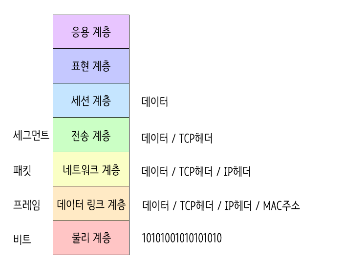
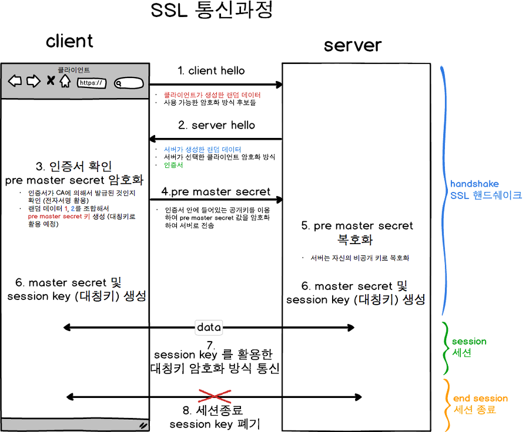

### OSI 7계층

| 계층 (번호) | 계층 이름 | 주요 역할 | 대표 프로토콜 / 예시 |
| --- | --- | --- | --- |
| **7** | **애플리케이션 계층 (Application Layer)** | 사용자가 직접 접근하는 계층으로, 애플리케이션이 네트워크 서비스를 이용할 수 있도록 함 | **HTTP / HTTPS**, **SMTP**, **POP3**, **IMAP**, **DNS**, **FTP**, **SNMP**, **SSH**, **Telnet**, **NTP**, **MQTT** |
| **6** | **프레젠테이션 계층 (Presentation Layer)** | 데이터의 형식 변환, **암호화 / 복호화**, **압축 / 해제**, 인코딩 처리 | **SSL/TLS**, **MIME**, **JPEG**, **MPEG**, **ASCII**, **EBCDIC** |
| **5** | **세션 계층 (Session Layer)** | 통신 세션의 **설정, 유지, 종료** 및 동기화 관리 | **RPC**, **NetBIOS**, **Sockets**, **PPTP**, **SAP** |
| **4** | **전송 계층 (Transport Layer)** | 송·수신 간 **종단 간 데이터 전송**, **오류 제어**, **흐름 제어** | **TCP**, **UDP**, **SCTP** |
| **3** | **네트워크 계층 (Network Layer)** | 패킷을 목적지까지 라우팅, **IP 주소 관리**, **경로 선택** | **IP (IPv4/IPv6)**, **ICMP**, **IGMP**, **IPsec**, **ARP**, **RIP**, **OSPF**, **BGP** |
| **2** | **데이터 링크 계층 (Data Link Layer)** | 같은 네트워크 내에서 프레임 단위의 전송, **오류 검출 및 수정** | **Ethernet**, **PPP**, **HDLC**, **Frame Relay**, **ATM**, **VLAN (802.1Q)**, **MAC** |
| **1** | **물리 계층 (Physical Layer)** | 실제 데이터(비트)를 전기적/광학적 신호로 변환하여 전송 | **IEEE 802.3 (Ethernet)**, **RS-232**, **DSL**, **USB**, **Bluetooth**, **광케이블**, **Wi-Fi(802.11)** |

<aside>

## **왜 한 번에 비트스트림으로 바꾸지 않는가?**

### 1. **계층별로 역할이 다름**

- 전송 계층은 **어떤 앱끼리 통신할지(포트)** 관리
- 네트워크 계층은 **어디로 갈지(IP)** 관리
- 데이터링크 계층은 **같은 네트워크 내 어떤 장치와 연결할지(MAC)** 관리

  ➡ 각각의 역할에 필요한 정보가 다르기 때문에 단계별로 헤더를 추가해야 함

### 2. **유연성과 호환성 확보**

- IP는 전 세계 공통,
- 이더넷(MAC)은 로컬 네트워크용,
- TCP/UDP는 앱 통신용.

  한 번에 처리하면 이 구조적 분리가 사라져서 **서로 다른 네트워크 장비 간 호환이 불가능**해집니다.

### 3. **문제 발생 시 어느 계층의 문제인지 파악 가능**

예를 들어

- 전송 계층 문제 → 패킷이 갔지만 응답 없음 (TCP 재전송)
- 네트워크 계층 문제 → IP 경로 오류
- 데이터링크 문제 → 같은 LAN 내 충돌

  이렇게 **문제의 원인을 분리**할 수 있습니다.

### 4. **다양한 하위 기술에 독립적**

- 물리 계층은 Wi-Fi, 광케이블, 블루투스 등 다양한 전송매체를 가질 수 있음
- 상위 계층은 이 매체가 무엇이든 신경 쓸 필요가 없음

  ➡ 프레임·패킷 구조 덕분에 **매체 독립적인 통신**이 가능해짐

</aside>

## 계층별 데이터 단위 (PDU: Protocol Data Unit)

| 단계 | OSI 계층 | 데이터 단위 이름 | 주요 역할 | 예시 헤더 정보 |
| --- | --- | --- | --- | --- |
| **7~5계층** | 애플리케이션/프레젠테이션/세션 | **데이터 (Data)** | 사용자의 실제 메시지 | “GET /index.html HTTP/1.1” |
| **4계층** | 전송 계층 | **세그먼트 (Segment)** | 송수신 간 연결, 오류 제어 | 송신자·수신자 포트번호, 순서번호 |
| **3계층** | 네트워크 계층 | **패킷 (Packet)** | 라우팅(경로 선택), IP 주소 지정 | 출발지 IP / 목적지 IP |
| **2계층** | 데이터링크 계층 | **프레임 (Frame)** | 같은 네트워크 내 전송, 오류 검출 | 출발지 MAC / 목적지 MAC |
| **1계층** | 물리 계층 | **비트스트림 (Bit Stream)** | 전기/광 신호로 변환 | 01001011... |

### ✏️ HTTP vs HTTPS

### **HTTP vs HTTPS 비교표**

| 구분 | **HTTP (HyperText Transfer Protocol)** | **HTTPS (HTTP Secure / HTTP over SSL/TLS)** |
| --- | --- | --- |
| **포트 번호** | 기본적으로 **80번 포트** 사용 | 기본적으로 **443번 포트** 사용 |
| **보안 수준** | ❌ 암호화 없음 → 평문 전송 | ✅ SSL/TLS로 암호화되어 안전한 통신 |
| **데이터 전송 방식** | 요청/응답 데이터가 **그대로 전송** | 요청/응답 데이터가 **암호화 후 전송** |
| **인증서 사용 여부** | 사용하지 않음 | **SSL/TLS 인증서 필요** (CA 발급) |
| **URL 형태** | `http://example.com` | `https://example.com` |
| **데이터 도청 위험** | 높음 (패킷 스니핑으로 내용 유출 가능) | 매우 낮음 (암호화로 보호됨) |
| **변조 가능성** | 공격자가 중간에서 내용 수정 가능 (MITM 공격) | 서명 검증으로 변조 탐지 가능 |
| **사이트 신뢰도** | 브라우저 주소창에 ‘주의 요함’ 표시 | 자물쇠 🔒 표시로 신뢰성 확보 |
| **속도** | 약간 빠름 (암호화 과정 없음) | 초기 연결 시 SSL 핸드셰이크로 약간 느림, 하지만 HTTP/2 이상에선 거의 차이 없음 |
| **대표 사용 사례** | 내부 테스트 서버, 암호화 불필요한 통신 | 모든 현대 웹사이트 (로그인, 결제, 개인정보 등) |

<aside>

## SSL/TLS 암호화?

</aside>

### Reference
- https://www.cloudflare.com/ko-kr/learning/ddos/glossary/open-systems-interconnection-model-osi/
- https://brunch.co.kr/@swimjiy/47
- https://jibinary.tistory.com/169#google_vignette
- https://inpa.tistory.com/entry/WEB-%F0%9F%8C%90-OSI-7%EA%B3%84%EC%B8%B5-%EC%A0%95%EB%A6%AC