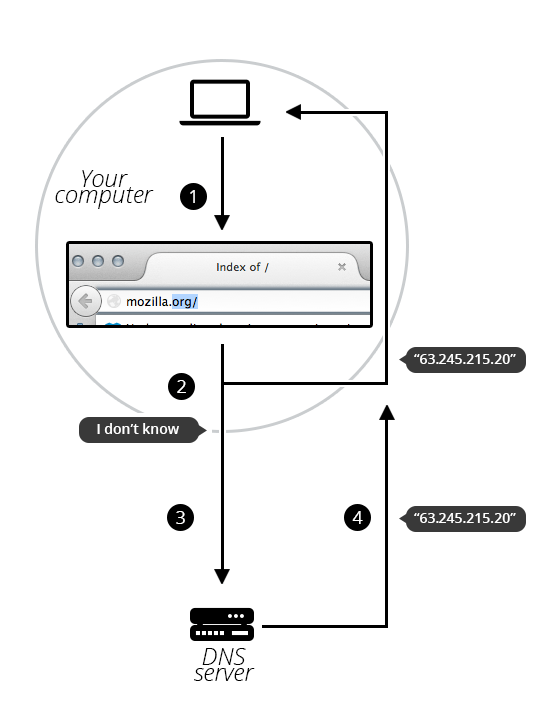

# Domain Name

`Domain Name 구조`


`TLD ( Top-Level Domain )`

TLD 는 가장 일반적인 정보를 제공합니다. TLD는 도메인 이름 뒤에 오는 확장자로, 해당 도메인의 서비스의 일반적인 목적을 사용자에게 알려줍니다. 가장 일반적인 TLD(.com, .org, .net)은 웹 서비스가 엄격한 기준을 충족시키지 않아도 되지만, 일부 TLD는 엄격한 정책을 시행할 수 있습니다. 예를 들어, .us, .fr, .sh와 같은 지역 TLD는 서비스가 특정 언어로 제공되거나 특정 국가에서 호스팅되어야 할 수도 있습니다.

`라벨(또는 구성 요소)`

라벨은 TLD 다음에 나오는 것입니다. 라벨은 한 글자에서 전체 문장까지 모든 것이 될 수 있습니다. TLD 바로 앞에 위치한 라벨은 보조 수준 도메인(SLD)이라고도 합니다. 도메인 이름은 많은 라벨(또는 구성 요소)을 가질 수 있으며, 도메인 이름을 구성하기 위해 반드시 3개의 라벨이 필요한 것은 아닙니다. 예를 들어 www.inf.ed.ac.uk는 올바른 도메인 이름입니다. 도메인 이름의 "상위" 부분을 제어할 때(예: [mozilla.org](http://mozilla.org/)), 다른 도메인 이름(때로는 "하위 도메인"이라고도 함)을 만들 수 있습니다(예: [developer.mozilla.org](http://developer.mozilla.org/)).

`도메인 이름은 누가 보유하고 있는가`

일반적으로 도메인 이름은 인터넷 주소 및 이름 지정 기관인 ICANN(Internet Corporation for Assigned Names and Numbers)이나 ICANN에서 승인한 도메인 이름 등록기관 또는 웹 호스팅 회사가 등록하고 관리합니다. 도메인 이름이 등록되면 웹사이트를 만들거나 이메일 주소를 설정하는 등의 용도로 사용할 수 있습니다.

`이용 가능한 도메인 이름을 찾는법`

도메인 이름을 찾는 가장 일반적인 방법은 도메인 이름 등록기관을 사용하는 것입니다. 도메인 이름 등록기관은 도메인 이름이 사용 가능한지 확인하고 구매할 수 있는 웹사이트입니다. 대표적으로 `GoDaddy`와 `Namecheap`가 있습니다.

도메인 이름 등록기관 웹사이트에 방문하여 검색창에 원하는 도메인 이름을 입력하면, 이 도메인 이름이 사용 가능한지 여부를 알려줍니다. 사용 가능한 경우, 등록기관을 통해 도메인 이름을 구매할 수 있습니다.

이러한 등록기관에서는 도메인 이름을 구매하는 것 외에도, 다양한 도메인 관련 서비스를 제공하기도 합니다. 이메일 호스팅, 웹 호스팅, DNS 관리 등 다양한 기능을 제공하며, 이를 통해 도메인을 보다 효과적으로 관리할 수 있습니다.

```bash
# Command
$ whois mozilla.org

# response
Domain Name:MOZILLA.ORG
Domain ID: D1409563-LROR
Creation Date: 1998-01-24T05:00:00Z
Updated Date: 2013-12-08T01:16:57Z
Registry Expiry Date: 2015-01-23T05:00:00Z
Sponsoring Registrar:MarkMonitor Inc. (R37-LROR)
Sponsoring Registrar IANA ID: 292
WHOIS Server:
Referral URL:
Domain Status: clientDeleteProhibited
Domain Status: clientTransferProhibited
Domain Status: clientUpdateProhibited
Registrant ID:mmr-33684
Registrant Name:DNS Admin
Registrant Organization:Mozilla Foundation
Registrant Street: 650 Castro St Ste 300
Registrant City:Mountain View
Registrant State/Province:CA
Registrant Postal Code:94041
Registrant Country:US
Registrant Phone:+1.6509030800
```

`DNS request 의 작동 원리`

당신이 브라우저에서 웹 페이지를 보기 위해 도메인 이름을 입력하면 IP 주소보다 쉽게 입력할 수 있습니다. 이 과정을 살펴보겠습니다:

1. 브라우저의 주소 표시줄에 mozilla.org를 입력합니다.
2. 브라우저는 로컬 DNS 캐시를 사용하여 도메인 이름에 대한 IP 주소를 이미 인식하고 있는지 컴퓨터에 묻습니다. 이미 알고 있다면, 이름은 IP 주소로 변환되고 브라우저는 웹 서버와 콘텐츠를 협상합니다. 이제 끝입니다.
3. 컴퓨터가 [mozilla.org](http://mozilla.org) 이름 뒤에 있는 IP를 모르면, DNS 서버에 요청을 보내서 각 등록된 도메인 이름에 대한 IP 주소를 말해달라고 요청합니다.
4. 이제 컴퓨터가 요청한 IP 주소를 알고 있으므로 브라우저는 웹 서버와 콘텐츠를 협상할 수 있습니다.



`도메인 이름과 URL 의 차이점`

웹 주소라고도 하는 Uniform Resource Locator(URL)에는 사이트의 도메인 이름, 프로토콜, 경로 등의 정보가 포함됩니다. 예를 들어 URL `https://cloudflare.com/learning/` 에서 `cloudflare.com`은 도메인 이름이고 `https`는 프로토콜이며 `/learning/`은 웹 사이트의 특정 페이지에 대한 경로입니다.

> **참고**
>
> [MDN - What is domain name?](https://developer.mozilla.org/ko/docs/Learn/Common_questions/Web_mechanics/What_is_a_domain_name)
>
> [CloudFlare - 도메인 이름이란? 도메인 이름과 URL 의 비교](https://www.cloudflare.com/ko-kr/learning/dns/glossary/what-is-a-domain-name/)
