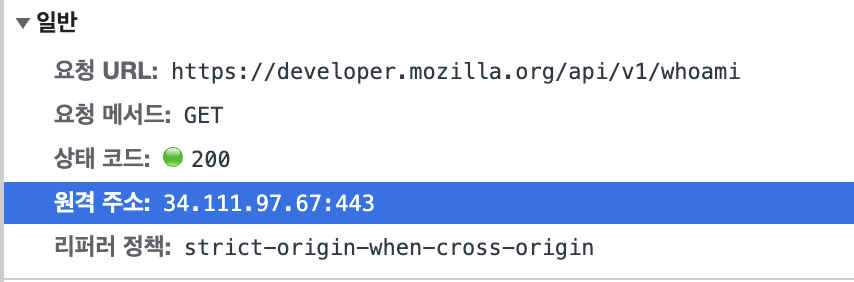

# 호스팅

### 웹페이지, 웹사이트, 웹서버 그리고 검색엔진의 차이

 

`웹페이지`

파이어폭스, 구글 크롬, 오페라, MS 익스플로러나 엣지, 애플의 사파리 같은 웹 브라우저에서 보여지는 문서이다. 이런 것들을 단순히 "페이지"라고 하기도 한다.

 

`웹사이트`

다양한 방식으로 그룹으로 묶이거나 연결된 웹 페이지들의 모음이다. 보통 "웹사이트"나 단순히 "사이트"라고 한다. 예를 들면 참고하고 있는[`https://developer.mozilla.org`](https://developer.mozilla.org/ko/) 이 웹사이트이다.

웹 페이지와 웹사이트에 대한 생각은 특히 하나의 웹 페이지만 포함하는 웹사이트에서 혼동하기 쉽습니다. 예시로 들고 있는 웹사이트 또한 이와 같은데 이를 보통 싱글 페이지 웹사이트 ( single-page website ) 라고 합니다.

 

`웹 서버`

인터넷에 웹사이트를 호스팅하는 컴퓨터이다.

위 사진은 [`https://developer.mozilla.org/ko/`](https://developer.mozilla.org/ko/) 해당 웹사이트에 들어갔을 때 요청한 `request header` 이다. 이를 살펴보니 `34.111.97.67` 에 해당하는 IP 를 가지고 있는 서버가 바로 `해당 웹사이트의 웹 서버`다.

웹 서버는 여러 웹사이트에 호스팅될 수 있기 때문에, 웹 서버라는 용어는 절대 웹사이트를 지정하기 위해 사용하지 않는다.

 

`검색 엔진`

구글, 빙, 야후 같은 다른 웹 페이지들을 찾게 도와주는 웹사이트이다. 검색 엔진은 웹 페이지를 다른 웹사이트에서 찾을 수 있게 도와주는 특별한 종류의 웹사이트입니다.

**_브라우저_**는 소프트웨어의 한 조각으로, 웹 페이지를 검색하고 보여줍니다; **_검색 엔진_**은 사람들이 다른 웹사이트에서 웹 페이지를 찾도록 도와주는 웹 사이트입니다.

> **참고**
>
> [웹페이지, 웹사이트, 웹서버 그리고 검색엔진의 차이는 무엇일까요? - Web 개발 학습하기 | MDN](https://developer.mozilla.org/ko/docs/Learn/Common_questions/Web_mechanics/Pages_sites_servers_and_search_engines)

 

### 웹 서버란?

"웹 서버"는 하드웨어, 소프트웨어 혹은 두 개가 같이 동작하는 것을 의미할 수 있습니다.

 

1. `하드웨어 측면에서, 웹 서버는 웹 서버의 소프트웨어와 website의 컴포넌트 파일들을 저장하는 컴퓨터입니다.` (컴포넌트 파일에는 HTML 문서, images, CSS stylesheets, 그리고 JavaScript files가 있습니다.) 웹 서버는 인터넷에 연결되어 웹에 연결된 다른 기기들이 웹 서버의 데이터(컴포넌트 파일들)를 주고받을 수 있도록 합니다.
2. `소프트웨어 측면에서, 웹 서버는 기본적으로 웹 사용자가 어떻게 호스트 파일들에 접근하는지를 관리합니다.` 이 문서에서 웹 서버는 HTTP서버로 국한합니다. HTTP 서버는 URL(Web addresses)과 HTTP(당신의 브라우저가 웹 페이지를 보여주기 위해 사용하는 프로토콜)의 소프트웨어 일부입니다.

 

가장 기본적인 단계에서, 브라우저가 웹 서버에서 불려진 파일을 필요로 할때, 브라우저는 HTTP를 통해 파일을 요청합니다. 요청이 올바른 웹 서버(하드웨어)에 도달하였을 때, HTTP 서버(software)는 요청된 문서를 HTTP를 이용해 보내줍니다.

 

 

웹 사이트를 공개하기 위해서는, 당신은 정적 혹은 동적 웹 서버가 필요합니다.

 

`정적 웹 서버`

정적 웹 서버 혹은 스택은 HTTP 서버 (소프트웨어)가 있는 컴퓨터(하드웨어)로 구성되어 있습니다. 서버가 그 불려진 파일을 당신의 브라우저에게 전송하기 때문에, 저희는 그것을 "정적"이라고 부릅니다.

 

`동적 웹 서버`

`동적 웹 서버는 정적 웹 서버와 추가적인 소프트웨어(대부분 일반적인 애플리케이션 서버와 데이터베이스)로 구성되어 있습니다.` 애플리케이션 서버가 HTTP 서버를 통해 당신의 브라우저에게 불려진 파일들을 전송하기 전에, 애플리케이션 서버가 업데이트하기 때문에 우리는 이것을 동적이라고 부릅니다.

 

동적 웹 서버는 PHP, Python 또는 Ruby와 같은 서버 측 스크립팅 언어를 사용하여 작동할 수 있습니다. 이러한 언어를 사용하면 `데이터베이스와 상호 작용하고 동적 콘텐츠를 생성하며 복잡한 계산을 수행 할 수있는 웹 페이지`를 만들 수 있습니다.

예를 들어, 동적 웹 서버는 사용자가 항목을 장바구니에 추가하고 주문 내역을 볼 수 있으며 결제를 할 수있는 전자 상거래 사이트를 만드는 데 사용할 수 있습니다. 서버는 스크립팅 언어를 사용하여 데이터베이스와 상호 작용하여 이 정보를 저장하고 검색하며, 사용자 요청에 따라 동적으로 페이지를 생성합니다.

 

`HTTP를 이용한 통신`

 

`HTTP의 특징`

1. Textual(문자로 된)

모든 명령어들은 기본 문자이며 사람들이 읽을 수 있습니다.

1. Stateless(독립적인)

`서버 혹은 클라이언트는 이전의 통신을 기억하지 않습니다.` 예를 들어, HTTP에만 의존하면, 서버는 당신이 입력한 비밀번호 혹 당신이 처리한 단계를 기억하지 못합니다. 당신은 그러한 일들을 위한 애플리케이션 서버가 필요합니다.

 

`규칙`

- 오직 클라이언트만이 HTTP 요청을 만들 수 있으며, 서버에게만 보낼 수 있습니다. 서버는 오직 클라이언트의 HTTP 요청에 응답할 수 있습니다.
- HTTP를 통해 파일을 요청할때, 클라이언트는 반드시 URL 파일들을 제공해야 합니다.
- 웹 서버는 반드시 최소한의 에러 메시지를 포함하여 모든 HTTP 요청에 응답해야합니다.

 

`HTTP 서버가 요청들에 응답하고 처리하는 과정`

1. 요청을 받으면, HTTP 서버는 먼저 요청받은 URL이 존재하는 파일과 매칭이 되는지를 확인합니다.
2. 만약 매칭된다면, 웹 서버는 그 파일 내용을 브라우저에게 되돌려줍니다. 만약 그렇지 않다면, 애플리케이션 서버는 필요한 파일을 구축합니다.
3. 만약 위 둘의 과정이 불가능하다면, 웹 서버는 브라우저에게 에러 메시지를 반환합니다, 대부분의 에러 메시지는 "404 Not Found" 입니다.(이 에러는 너무 많이 발생하여 많은 웹 디자이너들은 404 Error Pages 를 디자인하는데 많은 시간을 할애합니다.

 

> **참고**
>
> https://developer.mozilla.org/ko/docs/Learn/Common_questions/Web_mechanics/What_is_a_web_server
