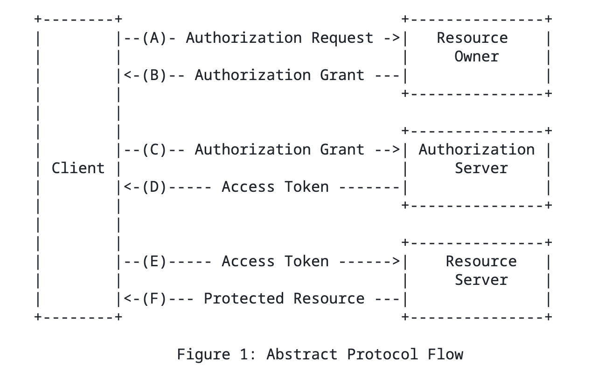
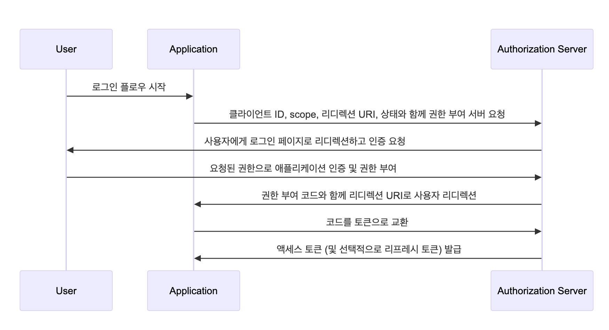

# OAuth 2.0

## 개요

Open Authorization 2.0 은 웹 및 어플리케이션 인증 및 권한 부여를 위한 개방형 표준 프로토콜을 말한다.

## OAuth 2.0 의 역할(주체)

- `리소스 소유자(Resource Owner)`: OAuth 2.0 프로토콜을 사용하여 보호되는 리소스에 대한 액세스 권한을 부여하는 사용자(엔티티)입니다. 클라이언트를 인증(Authorize)하는 역할을 수행합니다. 예를 들어 네이버 로그인에서 네이버 아이디를 소유하고 third-party 애플리케이션(클라이언트)에 네이버 아이디로 소셜 로그인 인증을 하는 사용자를 의미합니다.
- `클라이언트(Client)`: OAuth 2.0을 사용하여 리소스에 접근하려는 third-party 애플리케이션이나 서비스입니다.
- `권한 서버(Authorization Server)`: 권한 서버는 클라이언트가 리소스 소유자의 권한을 얻을 수 있도록 도와주는 서버입니다. 권한 서버는 사용자 인증, 권한 부여 및 토큰 발급을 관리합니다.
- `리소스 서버(Resource Server)`: 리소스 서버는 보호되는 리소스를 호스팅하는 서버로, 액세스를 허용하거나 거부합니다. 이 서버는 OAuth 2.0 토큰을 사용하여 클라이언트에게 리소스에 액세스할 권한을 부여하고 실제 데이터를 제공합니다.

## OAuth 2.0 용어 

- `액세스 토큰(Access Token)`: 클라이언트가 리소스 서버의 리소스에 접근하기 위한 권한을 부여받는 토큰입니다. 액세스 토큰은 권한 서버로부터 발급되며, 일반적으로 제한된 유효 기간을 가지고 있습니다.
- `리프레시 토큰(Refresh Token)`: 리프레시 토큰은 액세스 토큰의 유효 기간이 만료된 후 새로운 액세스 토큰을 받기 위한 토큰입니다. 이를 통해 사용자는 다시 로그인할 필요 없이 토큰 유효 시간 갱신만으로 계속 애플리케이션을 사용할 수 있습니다.
- `범위(Scope)`: 범위는 클라이언트가 리소스에 대한 어떤 작업을 수행할 수 있는지를 정의하는 문자열입니다. 범위는 권한 서버에 의해 정의되며, 클라이언트는 특정 범위의 액세스 권한을 요청할 수 있습니다.
- `인증 코드(Authorization Code)`: 인증 코드는 클라이언트가 액세스 토큰을 얻기 위한 중간 단계로 사용되는 코드입니다. 인증 코드 부여(Authorization Code Grant) 방식을 통해 권한 서버로부터 발급되며, 이를 사용하여 액세스 토큰과 리프레시 토큰을 얻을 수 있습니다.

## OAuth Flow 



- (A) 클라이언트가 리소스 오너(e.g 구글)에게 승인을 요청합니다
- (B) 클라이언트는 리소스 오너에게 인가에 대한 증명을 받습니다. 인가의 증명은 네 가지가 있습니다.
  - Authorization Code
  - Implicit
  - Resource Owner Password Credentials
  - Client Credentials
- (C) 클라이언트가 (B) 에서 부여받은 증명을 통해서 액세스 토큰을 요청합니다.
- (D) 인증 서버는 전달받은 증명을 통해 클라이언트를 검증하고 액세스 토큰을 반환합니다.
- (E) 액세스 토큰을 전달하며 리소스에 대해 접근을 요청합니다.
- (F) 액세스 토큰을 검증하고 유효하다면 리소스를 반환합니다.

## Authorization Grant Type

### Authorization Code Flow

가장 일반적인 권한 부여 메커니즘으로 authorization code 를 가장 안전하게 저장할 수 있는 서버 측 웹 어플리케이션에 적합한 메커니즘입니다.

사용자의 동의를 받기 때문에 해당 메커니즘을 통해 받은 액세스 토큰은 사용자에 대한 정보가 포함됩니다.



위 플로우에서 인가 코드에 대한 요청을 인가 서버로 보낼 때는 다음과 같은 형식을 취합니다.

```http request
https://authorization-server.com/auth
 ?response_type=code
 &client_id=29352915982374239857
 &redirect_uri=https%3A%2F%2Fexample-app.com%2Fcallback
 &scope=create%2delete
 &state=xcoiv98y2kd22vusuye3kch
```

- `response_type=code` : 애플리케이션이 Authorization Code Flow(인가 코드 방식) 를 시작한다는 것을 인증 서버에 알립니다.

- `client_id` : 개발자가 애플리케이션을 등록할 때 발급받은 애플리케이션의 공개 식별자입니다.

- `redirect_uri` : 사용자가 요청을 승인한 후, 인증 서버가 사용자를 다시 돌려보낼 주소를 지정합니다.

- `scope` : 애플리케이션이 요청하는 권한 범위를 나타내는 하나 이상의 문자열입니다.
(공백으로 구분되며, 사용 중인 OAuth API가 지원하는 scope를 정의합니다.)

- `state` : 애플리케이션이 생성한 임의의 랜덤 문자열을 요청에 포함합니다.
이후 인증 완료 시 동일한 값이 반환되는지 확인해야 하며, 이는 CSRF 공격 방지 목적으로 사용됩니다.

전달받은 client_id 에 해당하는 클라이언트가 등록되어있고 redirect_uri, scope 등이 일치하는지 검증하고 인증 코드를 발급합니다.

```http request
https://example-app.com/callback
 ?code=g0ZGZmNjVmOWIjNTk2NTk4ZTYyZGI3
 &state=xcoiv98y2kd22vusuye3kch
```

이제 전달받은 인가 코드를 통해서 리소스에 접근하기 위한 액세스 토큰을 요청을 보냅니다.

- `grant_type=authorization_code` : 애플리케이션이 Authorization Code grant 방식을 사용하고 있음을 토큰 엔드포인트에 알립니다.
- `code` : 리다이렉트 과정에서 발급받은 인가 코드(authorization code) 를 포함합니다.
- `redirect_uri` : 인가 코드를 요청할 때 사용했던 동일한 redirect URI 입니다. 일부 API는 이 파라미터를 요구하지 않을 수 있으므로, 사용 중인 API 문서를 확인해야 합니다.
- `client_id` : 애플리케이션의 클라이언트 ID 입니다.
- `client_secret` : 애플리케이션의 클라이언트 시크릿 입니다.

```
response

HTTP/1.1 200 OK
Content-Type: application/json
Cache-Control: no-store
Pragma: no-cache

{
  "access_token":"MTQ0NjJkZmQ5OTM2NDE1ZTZjNGZmZjI3",
  "token_type":"bearer",
  "expires_in":3600,
  "refresh_token":"IwOGYzYTlmM2YxOTQ5MGE3YmNmMDFkNTVk",
  "scope":"create delete"
}
```

### Client Credentials Flow

일반적으로 해당 메커니즘은 클라이언트가 서버나 서비스인 Machine-to-machine 통신에 사용됩니다.

해당 메커니즘에서는 따로 절차를 거치지 않고 클라이언트 발급 시에 얻은 client_id, client_secret 값만을 가지고 인가 절차를 거칩니다.

때문에 사용자를 특정할 수 없어 액세스 토큰에는 클라이언트의 정보만 담기기 때문에 클라이언트 정보에 대한 리소스 접근이 필요할 때 사용합니다.

- `grant_type`: 클라이언트 자격 증명 흐름을 나타내기 위해 `client_credentials로` 설정해야 합니다.
- `client_id`: 인증 서버에서 발급한 클라이언트 식별자입니다.
- `client_secret`: 인증 서버에서 발급한 클라이언트 비밀입니다.
- `scope`: 액세스 토큰에 대한 요청된  scopes (스코프) (권한)입니다.
- `resource`: 요청된 리소스에 대한  리소스 인디케이터 (Resource indicator) 를 지정하는 선택적 매개변수입니다. 이 매개변수를 사용하려면 인증 서버가  RFC 8707 을 지원해야 합니다.

### 그 외

- Implicit
- Resource Owner Password Credentials

두 가지 방법이 더 있지만 OAuth 2.1 에서 공식적으로 deprecated 되었기 때문에 다루지 않겠습니다.

## 보안 고려사항

OAuth 2.0에는 여러 보안 권장 및 요구 사항이 포함되어 있습니다:

- TLS 사용 필수 → 통신 암호화
- state 파라미터 사용 → CSRF 공격 방지
- Redirect URI 검증 → 인증 코드 탈취 방지
- Client authentication → 클라이언트 검증 (비밀키, TLS 등)

### 참고 
- [네이버 클라우드 OAuth2.0 개념 설명 글](https://guide.ncloud-docs.com/docs/b2bpls-oauth2)
- [RFC 6749](https://datatracker.ietf.org/doc/html/rfc6749)
- [OAuth 2.1](https://datatracker.ietf.org/doc/draft-ietf-oauth-v2-1/)
- [Authorization Code Flow](https://developer.okta.com/blog/2018/04/10/oauth-authorization-code-grant-type)
- [Authorization Code Flow - Auth Wiki](https://auth-wiki.logto.io/ko/authorization-code-flow)
- [Client Credentials Flow](https://auth0.com/docs/get-started/authentication-and-authorization-flow/client-credentials-flow/call-your-api-using-the-client-credentials-flow)
- [Client Credentials Flow - Auth Wiki](https://auth-wiki.logto.io/ko/client-credentials-flow)